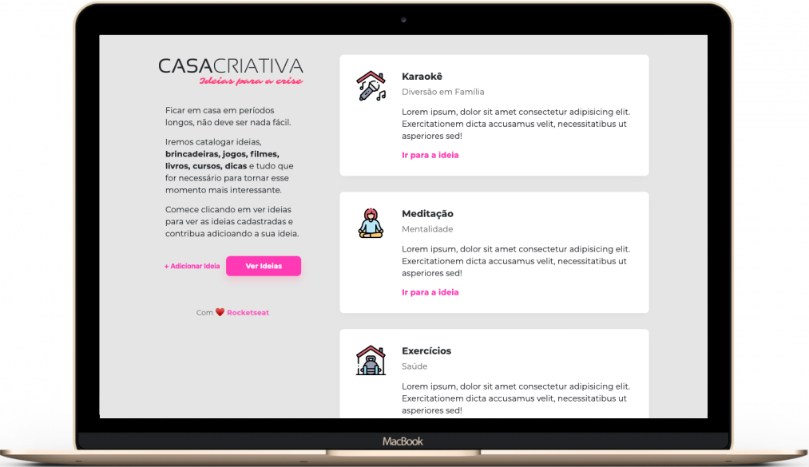

<h1 align="center">CasaCriativa</h1>

 

  <a href="#rocket-technologies">Technologies</a>&nbsp;&nbsp;&nbsp;|&nbsp;&nbsp;&nbsp;
  <a href="#-project">Project</a>&nbsp;&nbsp;&nbsp;|&nbsp;&nbsp;&nbsp;
  <a href="#electric_plug-getting-started">Getting started</a>

  

 

  

## :rocket: Technologies

This project features all the latest tools and practices in web development!

- HTML
- CSS
- JavaScript
- Node.js

## 💻 Project

This is a study project about workshopdev by Rocketseat :books:

## :electric_plug: Getting started

1. Clone this repo using: `https://github.com/joao-lucas-dev/casacriativa-workshopdev.git`
2. Move yourself to the appropriate directory: `cd casacriativa-workshopdev`
3. To install all dependencies, run: `yarn`
4. Run `yarn dev` to start the node
5. In the browser, enter `http://localhost:3333`

